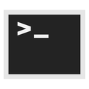

<h1 align="center" style="position: relative;">
   
  Termello
</h1>

<h3 align="center">A terminal emulator made in Electron</h3>

  <a href="https://github.com/mellobacon/Termello/blob/master/LICENSE">License</a> •
  <a href="https://github.com/mellobacon/Termello/releases">Download</a> •
  <a href="https://github.com/mellobacon/Termello/blob/master/CHANGELOG.md">Changelog</a>

  <h2>How to run it</h2>
  <strong>Note: This Terminal runs on Windows only</strong>
  
Run the setup.exe to install. Type <code>help</code> for a list of commands.
   Currently you cam use common UNIX commands. More will be added soon!

 

<h2>Getting help</h2>

You can get help by creating an <a href="https://github.com/mellobacon/Termello/issues/new/choose">issue</a> and asking your question.

 

<h2>Credits</h2>

Made by <a href="https://github.com/mellobacon">@mellobacon</a>
 Name idea and readme design by <a href="https://github.com/ANF-Studios">@ANF-Studios</a>.

